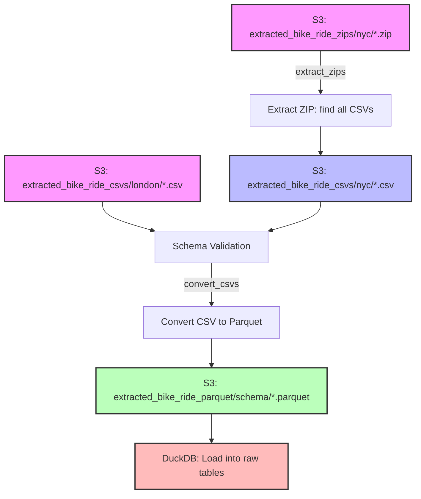

# City Cycles Analytics

This project demonstrates a full-stack, automated analytics pipeline for comparing bike share systems in New York City (CitiBike) and London (Santander Cycles). It showcases robust engineering, cloud infrastructure, and modern analytics best practices and includes a roadmap for future development and enhancement.

---

## Project Overview

I built an end-to-end, automatable flow that:

- **Utilizes modern cloud infrastructure** 
- **Extracts and ingests data from multiple sources**
- **Performs schema validation and data modeling**
- **Transforms and unifies data with dbt** 
- **Visualizes results in a modern dashboard** 
- **Automates and documents the entire process**

---

## Dashboard

🔗 [View the Dashboard (Streamlit Cloud)](https://city-cycles.streamlit.app/)

---

## Infrastructure

- **AWS S3:** Centralized storage for all raw and processed data.
- **DuckDB:** Embedded analytics database for data processing and transformation.
  - **On-Demand Processing:** Fresh DuckDB instance created for each pipeline run (via Docker).
  - **Benefits:** Faster analytics queries and lower costs compared to traditional RDS solutions.
- **Railway:** Container platform for pipeline execution via cron schedule.
  - **Deployment:** Containerized pipeline via Docker (`Dockerfile`, `railway.toml`).
  - **Cost Efficiency:** Ephemeral architecture — runs only when needed.
- **Streamlit Cloud:** Free public hosting for the dashboard.

---

## Pipeline Orchestrator (`~/orchestrator/`)

The orchestrator provides a single entry point for managing the complete end-to-end pipeline:

### Features
- **Unified Coordination:** Manages all pipeline stages from a single command
- **Flexible Execution:** Run complete pipeline or individual stages
- **Production-Ready:** Designed for monthly batch runs on Railway (Docker) or EC2 with cron scheduling
- **Incremental Strategy:** Leverages dbt incremental models for 37% faster runtime
- **Comprehensive Logging:** Detailed logging and error reporting at each stage

### Pipeline Stages

```
1. Extract Data         → Download NYC & London bike data to S3
2. Weather Extraction   → Fetch historical/incremental weather data from Open-Meteo API
3. File Management      → Unzip, validate schemas, convert to Parquet
4. Database Load        → Load Parquet files into DuckDB raw tables
5. dbt Transform        → Run incremental transformations (staging → marts)
6. Mart Export          → Export analytics tables to S3 for dashboard
```

### Quick Start

```bash
# Run complete pipeline
python -m orchestrator.cli run

# Run with full dbt refresh (quarterly recommended)
python -m orchestrator.cli run --dbt-full-refresh

# Run individual stage
python -m orchestrator.cli stage dbt

# Check pipeline status
python -m orchestrator.cli status
```

### Scheduling

Monthly runs configured via cron on EC2:
```bash
# Monthly run (1st of each month at 2 AM)
0 2 1 * * cd /home/ubuntu/city-cycles && python -m orchestrator.cli run

# Quarterly full refresh (every 3 months at 3 AM)
0 3 1 1,4,7,10 * cd /home/ubuntu/city-cycles && python -m orchestrator.cli run --dbt-full-refresh
```

**See `orchestrator/README.md` for complete documentation. Deployment: `Dockerfile` + `railway.toml` for Railway, `documentation/archive/ec2-deployment-guide.md` for EC2. See `documentation/archive/incremental-processing-guide.md` for incremental update strategy.**

---

## Data Extraction (`~/extraction/`)

The extraction module handles the single concern of scraping files from the web and getting them into S3:

### NYC Data Extraction
- **Source:** Public S3 bucket (`tripdata`) containing CitiBike ZIP files
- **Method:** Uses `boto3` with unsigned access to list and download ZIP files
- **Storage:** Uploads ZIP files to `extracted_bike_ride_zips/nyc/` in project S3 bucket
- **Features:** Year-based filtering, duplicate detection, ZIP validation

### London Data Extraction  
- **Source:** Transport for London (TfL) website (`cycling.data.tfl.gov.uk`)
- **Method:** Uses Playwright for headless browser automation (no direct S3 access)
- **Storage:** Downloads CSV files directly to `extracted_bike_ride_csvs/london/` in project S3 bucket
- **Features:** Dynamic page scrolling, file pattern matching, XLS-to-CSV conversion

---

## Data Models (`~/data_models/`)

The data models package provides schema validation and data transformation for bike share data:

### Architecture
- **Focused Responsibility:** Handles schema validation and data transformation only
- **Clean Separation:** S3 operations handled by `extracted_file_manager/`, database operations by `db_duckdb/`
- **Model Registry:** Central registry of all available data models for automatic discovery

### Supported Schemas
- **NYC Legacy** (`NYCLegacyBikeShareRecord`): CitiBike data from 2013-2016
- **NYC Modern** (`NYCModernBikeShareRecord`): CitiBike data from 2017-present
- **London Legacy** (`LondonLegacyBikeShareRecord`): Santander Cycles data from 2010-2022
- **London Modern** (`LondonModernBikeShareRecord`): Santander Cycles data from 2022-present

### Core Functionality
- **Schema Validation:** `validate_schema()` method ensures CSV files match expected column structures
- **Data Transformation:** `to_dataframe()` method converts raw data to standardized format
- **Required Columns:** `_required_columns` attribute defines mandatory fields for each schema
- **Integration Points:** Used by `extracted_file_manager/` for validation and `db_duckdb/` for transformation

---

## File Processing (`~/extracted_file_manager/`)

The extracted file manager handles the single concern of processing extracted files into optimized Parquet format for analytics:

### Processing Pipeline



### Key Features

- **Schema Validation:** Uses data models from `~/data_models/` to validate CSV schemas and organize Parquet files by schema type
- **Memory Management:** Advanced memory monitoring and cleanup to prevent OOM errors
- **Idempotent Processing:** Simple file existence checks ensure safe re-runs without complex metadata tracking
- **Pipeline Separation:** Independent `extract_zips` and `convert_csvs` commands for granular control
- **Streaming Processing:** Uses pandas chunking with pyarrow for memory-efficient large file processing
- **MacOSX Artifact Filtering:** Automatically filters out `._` files and `__MACOSX/` directories during processing

### Data Flow
1. **ZIP Processing:** Extracts CSV files from downloaded ZIP archives (NYC)
2. **Schema Detection:** Automatically matches files against data models (NYC Legacy/Modern, London Legacy/Modern)
3. **Parquet Conversion:** Converts validated CSVs to optimized Parquet format, organized by schema
4. **DuckDB Loading:** Processed Parquet files are ready for loading into DuckDB raw tables

---

## Data Loading (`~/db_duckdb/`)

The DuckDB pipeline handles the single concern of loading processed data into the analytics database:

### ETL Pipeline

- **Table Initialization:** Creates raw tables in DuckDB for NYC and London bike share data
- **S3 Integration:** Loads raw data from S3 Parquet files into DuckDB tables
- **Data Validation:** Verifies integrity and quality of loaded raw tables
- **Mart Export:** Exports dbt-generated mart tables from DuckDB to S3 as Parquet files for dashboard consumption

### Data Loading Process

- **Table Schemas:** Defined in `db_duckdb/config/duckdb_config.py`, matching structures from `data_models/`
- **Direct S3 Loading:** DuckDB reads Parquet files directly from S3 via httpfs extension (no intermediate downloads)
- **Full Replace:** Raw tables are rebuilt each run; incremental logic is handled by dbt downstream
- **Quality Checks:** Validates data integrity after loading (null counts, duplicates, date ranges)

---

## Transformation & Analytics

- **dbt** is used to:
  - Standardize and clean raw data in staging models.
  - Combine legacy and modern data into unified intermediate tables.
  - Build flexible, long-format metrics marts for analytics and dashboarding.
- **DuckDB Integration:** dbt runs against DuckDB for fast analytics processing
- **S3 Export:** Final metric marts are exported to S3 as Parquet files for dashboard consumption

---

## Dashboard

- **Multi-page atmospheric UI** with 4 pages:
  - **Landing:** Overview with real-time weather, city toggle, key metrics.
  - **Ride Analytics:** Historical trends, per-capita analysis, station growth, KPIs.
  - **Weather Deep Dive:** Temperature vs rides, precipitation impact, hourly weather analysis, station resilience map.
  - **City Comparison:** Side-by-side metrics, weather impact comparison, seasonal patterns.
- **Weather features:** Real-time forecasts (15-min auto-refresh), biking score (0-100), natural language recommendations, station-level weather resilience analysis.
- **Atmospheric theme:** Dark mode with time-of-day styling, weather CSS animations (rain, snow, sun, clouds), responsive Plotly charts.
- **Deployed on Streamlit Cloud** for public access.
- **Data Source:** Reads metric marts from S3 Parquet files exported by the DuckDB pipeline.

---

## Additional Documentation

### Core Components
- `orchestrator/README.md` — Complete orchestrator documentation and usage guide
- `data_models/README.md` — Data model architecture and schema validation
- `db_duckdb/README.md` — DuckDB ETL pipeline documentation
- `extracted_file_manager/README.md` — File processing pipeline documentation
- `extraction/README.md` — Data extraction from web sources
- `streamlit_data_manager/README.md` — Dashboard data management

### Architecture & Deployment
- `documentation/archive/SYSTEM-GUIDE.md` — System overview and quick start guide
- `documentation/archive/incremental-processing-guide.md` — Incremental processing guide
- `documentation/archive/incremental-pipeline-architecture.md` — Incremental dbt strategy and best practices
- `documentation/archive/ec2-deployment-guide.md` — EC2 deployment (archived; Railway is current)

### Planning
- `documentation/planning/ROADMAP.md` — Project enhancement roadmap

## Technologies Used

- **Python 3.8+** — Core language for all ETL, modeling, and orchestration
- **boto3** — AWS SDK for Python, used for S3 data access and management
- **Playwright** — Headless browser automation for scraping London data
- **pandas** — Data manipulation and validation
- **pyarrow** — Parquet processing and streaming
- **DuckDB** — Embedded analytics database for fast data processing
- **dbt (Data Build Tool)** — SQL-based data transformation, modeling, and analytics marts
- **AWS S3** — Cloud object storage for raw and processed data
- **Railway** — Container platform for pipeline deployment (`Dockerfile`, `railway.toml`)
- **Open-Meteo API** — Free weather data source for historical and forecast data
- **Streamlit** — Interactive dashboarding and web app framework
- **Plotly** — Advanced data visualization and charting
- **Streamlit Cloud** — Free public hosting for the dashboard
- **dotenv** — Environment variable management
- **pytest** — Automated testing framework (283 tests)
- **Git & GitHub** — Version control and collaboration
- **Claude Code** — AI-assisted coding, documentation, and pipeline development

---

## Roadmap & Next Steps

### Recently Completed (v2.0.0 — Feb 2026)
- **Weather Data Pipeline:** Open-Meteo API integration for hourly weather data across all years
- **Real-Time Weather Dashboard:** Live weather panel with 15-min auto-refresh and 48-hour forecasts
- **Weather-Informed Recommendations:** Biking score algorithm (0-100) with natural language insights
- **Station-Level Weather Analysis:** Resilience metrics and map visualization showing weather impact by location
- **Atmospheric UI Redesign:** Multi-page dashboard with dark theme, weather animations, and time-of-day styling
- **Railway Deployment:** Migrated from EC2 to Railway for containerized pipeline execution
- **Hourly Ride-Weather Analytics:** New dbt marts for weather-ride correlation analysis

### Additional Data Sources (Future)
- **Populations** — Validate population figures reflect coverage area for per-capita accuracy
- **Covid** — Annotated events data to contextualize anomalies and visualize pandemic impact

### Future Enhancements
- Route-focused insight (distance, heatmapping, common routes, inflow vs outflow)
- Bike-focused insight (in London using bike_id)
- Incremental raw table loading (track processed files, only load new)
- Monitoring and alerting (CloudWatch, SNS notifications)

---

## Contact

If you are interested in learning more or have questions about the project, please reach out:

christophertrogers37@gmail.com

## Data Sources & Acknowledgements

Special thanks to:
- [Transport for London (cycling.data.tfl.gov.uk)](https://cycling.data.tfl.gov.uk/) for making London Santander Cycles data publicly available
- [Citi Bike / Lyft](https://citibikenyc.com/system-data) for making NYC Citi Bike data publicly available

**This project demonstrates the design and implementation of a modern, cloud-native analytics stack—from raw data extraction to interactive dashboarding—using open-source tools and best practices.**