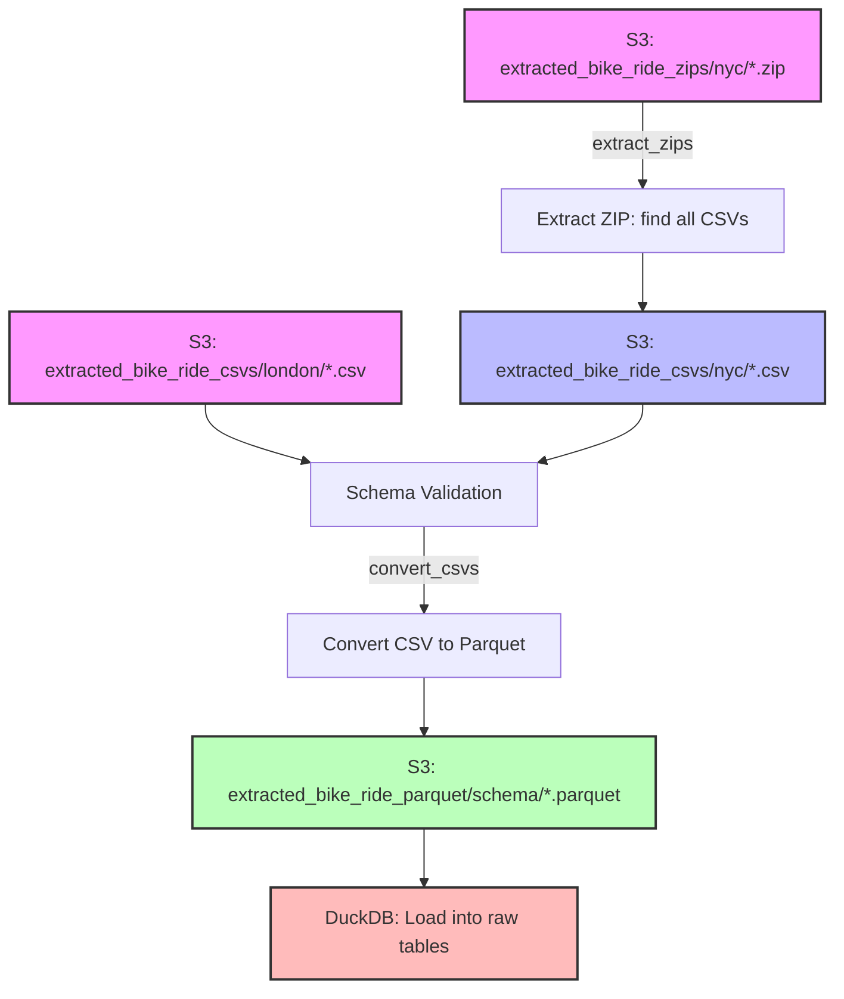

# City Cycles Analytics

This project demonstrates a full-stack, automated analytics pipeline for comparing bike share systems in New York City (CitiBike) and London (Santander Cycles). It showcases robust engineering, cloud infrastructure, and modern analytics best practices and includes a roadmap for future development and enhancement.

---

## Project Overview

I built an end-to-end, automatable flow that:

- **Utilizes modern cloud infrastructure** 
- **Extracts and ingests data from multiple sources**
- **Performs schema validation and data modeling**
- **Transforms and unifies data with dbt** 
- **Visualizes results in a modern dashboard** 
- **Automates and documents the entire process**

---

## Dashboard

🔗 [View the Dashboard (Streamlit Cloud)](https://city-cycles.streamlit.app/)

---

## Infrastructure

- **AWS S3:** Centralized storage for all raw and processed data.
- **DuckDB on AWS EC2:** Embedded analytics database for data processing and transformation.
  - **Architecture Note:** Uses DuckDB on EC2 for cost efficiency and improved performance.
  - **Benefits:** DuckDB provides faster analytics queries and lower costs compared to traditional RDS solutions.
- **AWS EC2 (Ubuntu):** Orchestration and processing environment.
- **Streamlit Cloud:** Free public hosting for the dashboard.

---

## Data Extraction (`~/extraction/`)

The extraction module handles the single concern of scraping files from the web and getting them into S3:

### NYC Data Extraction
- **Source:** Public S3 bucket (`tripdata`) containing CitiBike ZIP files
- **Method:** Uses `boto3` with unsigned access to list and download ZIP files
- **Storage:** Uploads ZIP files to `extracted_bike_ride_zips/nyc/` in project S3 bucket
- **Features:** Year-based filtering, duplicate detection, ZIP validation

### London Data Extraction  
- **Source:** Transport for London (TfL) website (`cycling.data.tfl.gov.uk`)
- **Method:** Uses Playwright for headless browser automation (no direct S3 access)
- **Storage:** Downloads CSV files directly to `extracted_bike_ride_csvs/london/` in project S3 bucket
- **Features:** Dynamic page scrolling, file pattern matching, XLS-to-CSV conversion

---

## Data Models (`~/data_models/`)

The data models package provides schema validation and data transformation for bike share data:

### Architecture
- **Focused Responsibility:** Handles schema validation and data transformation only
- **Clean Separation:** S3 operations handled by `extracted_file_manager/`, database operations by `db_duckdb/`
- **Model Registry:** Central registry of all available data models for automatic discovery

### Supported Schemas
- **NYC Legacy** (`NYCLegacyBikeShareRecord`): CitiBike data from 2013-2016
- **NYC Modern** (`NYCModernBikeShareRecord`): CitiBike data from 2017-present
- **London Legacy** (`LondonLegacyBikeShareRecord`): Santander Cycles data from 2010-2016
- **London Modern** (`LondonModernBikeShareRecord`): Santander Cycles data from 2017-present

### Core Functionality
- **Schema Validation:** `validate_schema()` method ensures CSV files match expected column structures
- **Data Transformation:** `to_dataframe()` method converts raw data to standardized format
- **Required Columns:** `_required_columns` attribute defines mandatory fields for each schema
- **Integration Points:** Used by `extracted_file_manager/` for validation and `db_duckdb/` for transformation

---

## File Processing (`~/extracted_file_manager/`)

The extracted file manager handles the single concern of processing extracted files into optimized Parquet format for analytics:

### Processing Pipeline

### Key Features

- **Schema Validation:** Uses data models from `~/data_models/` to validate CSV schemas and organize Parquet files by schema type
- **Memory Management:** Advanced memory monitoring and cleanup to prevent OOM errors
- **Idempotent Processing:** Simple file existence checks ensure safe re-runs without complex metadata tracking
- **Pipeline Separation:** Independent `extract_zips` and `convert_csvs` commands for granular control
- **Streaming Processing:** Uses pandas chunking with pyarrow for memory-efficient large file processing
- **MacOSX Artifact Filtering:** Automatically filters out `._` files and `__MACOSX/` directories during processing

### Data Flow
1. **ZIP Processing:** Extracts CSV files from downloaded ZIP archives (NYC)
2. **Schema Detection:** Automatically matches files against data models (NYC Legacy/Modern, London Legacy/Modern)
3. **Parquet Conversion:** Converts validated CSVs to optimized Parquet format, organized by schema
4. **DuckDB Loading:** Processed Parquet files are ready for loading into DuckDB raw tables

---

## Data Loading (`~/db_duckdb/`)

The DuckDB pipeline handles the single concern of loading processed data into the analytics database:

### ETL Pipeline

- **Table Initialization:** Creates raw tables in DuckDB for NYC and London bike share data
- **S3 Integration:** Loads raw data from S3 Parquet files into DuckDB tables
- **Data Validation:** Verifies integrity and quality of loaded raw tables
- **Mart Export:** Exports dbt-generated mart tables from DuckDB to S3 as Parquet files for dashboard consumption

### Data Loading Process

- **Schema Generation:** Table schemas are generated from the data models in `~/data_models/`
- **Batch Loading:** Efficient, chunked inserts from S3 to DuckDB
- **Data Transformation:** Uses data models' `to_dataframe()` method for standardization
- **Quality Checks:** Validates data integrity after loading

---

## Transformation & Analytics

- **dbt** is used to:
  - Standardize and clean raw data in staging models.
  - Combine legacy and modern data into unified intermediate tables.
  - Build flexible, long-format metrics marts for analytics and dashboarding.
- **DuckDB Integration:** dbt runs against DuckDB for fast analytics processing
- **S3 Export:** Final metric marts are exported to S3 as Parquet files for dashboard consumption

---

## Dashboard

- **Plotly + Streamlit** power an interactive analytics dashboard:
  - City-specific and comparative views.
  - Flexible date filtering, per-capita toggles, and trend overlays.
  - KPIs, time series, and station growth visualizations.
- **Deployed on Streamlit Cloud** for public access.
- **Data Source:** Reads metric marts from S3 Parquet files exported by the DuckDB pipeline.

---

## Additional Documentation

- See `data_models/README.md` for details on the data model architecture and usage.
- See `db_duckdb/README.md` for DuckDB ETL pipeline documentation.
- See `extracted_file_manager/README.md` for file processing pipeline documentation.
- See `resources/` for learnings, design notes, task flows, and architecture ideas that I accumulated along the way.

## Technologies Used

- **Python 3.8+** — Core language for all ETL, modeling, and orchestration
- **boto3** — AWS SDK for Python, used for S3 data access and management
- **Playwright** — Headless browser automation for scraping London data
- **pandas** — Data manipulation and validation
- **pyarrow** — Parquet processing and streaming
- **DuckDB** — Embedded analytics database for fast data processing
- **dbt (Data Build Tool)** — SQL-based data transformation, modeling, and analytics marts
- **AWS S3** — Cloud object storage for raw and processed data
- **AWS EC2 (Ubuntu)** — Cloud compute for orchestration and automation
- **Streamlit** — Interactive dashboarding and web app framework
- **Plotly** — Advanced data visualization and charting
- **Streamlit Cloud** — Free public hosting for the dashboard
- **dotenv** — Environment variable management
- **pytest** — Automated testing framework
- **Git & GitHub** — Version control and collaboration
- **ChatGPT & Cursor** — AI-assisted coding, documentation, and ideation

---

## Roadmap & Next Steps

### Additional Data Sources
- **Populations**
  - Validate that the population figures used reflect the total volume of people living within bike infrastructure coverage.
- **Weather**
  - Enrich the database with weather data and utilize it in analytics to provide weather-based insight on bike utilization.
- **Covid**
  - Bring in annotated events data to contextualize anomalies and visualize pandemic impact.

### Data Extraction
- **Completed:** Simplified file processing with idempotent operations and file existence checks

### Database Load
- **Improved Data Modeling**
  - Fix schemas for better performance and investigate indexing at load.
- **Utilize more efficient processing**
  - Remove pandas from the process, if possible, for greater efficiency.

### Analytics
- **Explore new metrics, categorizations, and areas of insight**
  - Station-focused metrics
  - Route-focused insight (distance, heatmapping, common routes, inflow vs outflow)
  - Bike-focused insight (in London using bike_id)
  - Segmentation by day of week
  - Segmentation by weather (bring in external data source)
  - Quantified seasonal effects
  - Quantified Covid effects (bring in external data source)

- Further automate and productionize the pipeline.

---

## Contact

If you are interested in learning more or have questions about the project, please reach out:

christophertrogers37@gmail.com

## Data Sources & Acknowledgements

Special thanks to:
- [Transport for London (cycling.data.tfl.gov.uk)](https://cycling.data.tfl.gov.uk/) for making London Santander Cycles data publicly available
- [Citi Bike / Lyft](https://citibikenyc.com/system-data) for making NYC Citi Bike data publicly available

**This project demonstrates the design and implementation of a modern, cloud-native analytics stack—from raw data extraction to interactive dashboarding—using open-source tools and best practices.**