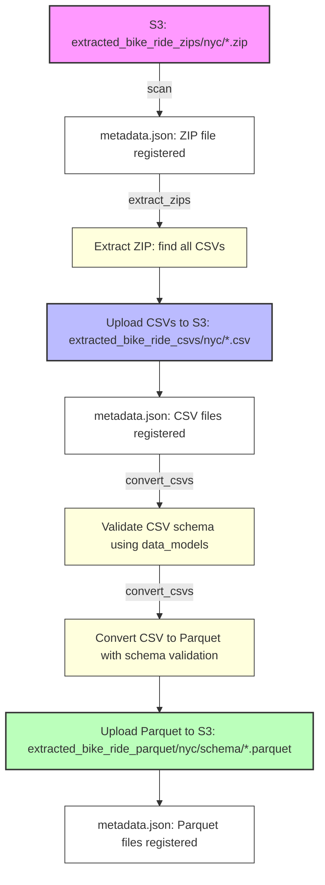

# Extracted File Manager: S3 ZIP/CSV/Parquet Pipeline

A robust file management system for processing bike share data from ZIP archives through CSV extraction to optimized Parquet storage, with comprehensive metadata tracking and memory management.

## Overview

The Extracted File Manager provides a complete pipeline for processing bike share data files from their raw extracted state to analytics-ready Parquet format. It handles the single concern of processing extracted files into optimized Parquet format for analytics, using data models from `~/data_models/` to validate schemas and properly format CSV files when creating Parquet files.

### Core Components

- **`manager.py`**: Main manager class (`ExtractedFileManager`) handling all file operations, S3 interactions, and pipeline logic
- **`cli.py`**: Command-line interface providing access to all manager functionality
- **`models.py`**: Data models for file metadata, status tracking, and summary statistics
- **`filetree.py`**: Utilities for processing ZIP file structures and nested archives
- **`__init__.py`**: Package initialization and exports

## Package Architecture

### Data Models (`models.py`)

The package defines several core data structures:

#### Enums
- **`FileStatus`**: Tracks file processing state
  - `EXTRACTED` - File has been downloaded to S3
  - `CSV_CONVERTED` - ZIP has been converted to CSV
  - `VALIDATED` - File has been schema validated
  - `PARQUET_CONVERTED` - CSV has been converted to Parquet
  - `PROCESSED` - File has been loaded into database
  - `FAILED` - File processing failed
  - `DELETED` - File has been deleted

- **`FileType`**: Identifies file types
  - `ZIP` - ZIP archive files
  - `CSV` - CSV data files
  - `PARQUET` - Parquet data files

- **`FileLocation`**: Geographic location
  - `NYC` - New York City files
  - `LONDON` - London files

#### Classes
- **`FileMetadata`**: Comprehensive file tracking
  - File identification (filename, S3 key, type, location)
  - Processing timestamps (extracted_at, validated_at, etc.)
  - Error tracking (validation_errors, processing_errors)
  - Custom metadata and schema overrides
  - JSON serialization/deserialization methods

- **`FileSummary`**: Aggregate statistics
  - Counts by status and file type
  - Total file count and size
  - Summary generation from FileMetadata objects

### File Tree Processing (`filetree.py`)

Provides a hierarchical structure for processing ZIP archives:

- **`Node`**: Base class for file tree elements
- **`Folder`**: Represents directories with child nodes
- **`File`**: Represents regular files with content
- **`ZipFile`**: Specialized file class that can extract itself
  - Handles nested ZIP files recursively
  - Processes complex directory structures
  - Skips Mac OS hidden files (`.DS_Store`, `._*`)
  - Case-insensitive CSV detection
- **`walk_folder()`**: Utility function to traverse folder trees

### Manager Class (`manager.py`)

The `ExtractedFileManager` class provides the core functionality:

#### Initialization & Metadata Management
- **`__init__()`**: Sets up S3 connection and loads metadata
- **`_load_metadata()`**: Loads metadata from S3 JSON file
- **`_save_metadata()`**: Persists metadata to S3
- **`scan_s3_files()`**: Discovers new files in S3

#### File Processing Pipeline
- **`convert_zip_to_csv()`**: Extracts CSVs from ZIP files
  - Handles nested ZIPs recursively
  - Uses temporary files for memory efficiency
  - Skips Mac OS artifacts
  - Uploads extracted CSVs to S3
  - Updates metadata with extraction results

- **`validate_file_schema()`**: Validates CSV schemas
  - Downloads 5MB samples for validation
  - Uses data models from `~/data_models/`
  - Supports schema overrides
  - Updates validation status and errors

- **`convert_csv_to_parquet()`**: Converts CSVs to Parquet
  - Uses pyarrow streaming with 5MB chunks
  - Applies data model transformations
  - Organizes by schema in S3 structure
  - Handles missing columns for schema overrides

#### File Management
- **`list_files()`**: Lists files with filtering options
- **`get_file_metadata()`**: Retrieves metadata for specific file
- **`get_file_summary()`**: Generates summary statistics
- **`print_summary()`**: Displays formatted summary

#### Error Recovery & Reprocessing
- **`list_failed_files()`**: Lists files with failed status
- **`reset_failed_files()`**: Resets failed files to extracted status
- **`reprocess_file()`**: Resets single file for reprocessing
- **`set_schema_override()`**: Sets manual schema override
- **`clear_schema_override()`**: Removes schema override

#### File Operations
- **`wipe_files()`**: Unified file deletion method
  - Supports filtering by type, location, or specific files
  - Handles S3 deletion and metadata cleanup
  - Special handling for Parquet files (resets CSV status)

#### Utility Methods
- **`_find_matching_model()`**: Identifies appropriate data model
- **`_download_csv_sample()`**: Downloads file samples for validation
- **`_get_column_types_for_model()`**: Maps data model fields to pyarrow types
- **`_add_missing_columns_for_model()`**: Adds missing columns for schema overrides
- **`_filter_files()`**: Centralized file filtering logic
- **`_log_memory_usage()`**: Memory monitoring
- **`_cleanup_memory()`**: Garbage collection and cleanup

#### Batch Processing
- **`process_files()`**: Unified processing method for all operations
- **`extract_zips()`**: Batch ZIP extraction
- **`convert_csvs()`**: Batch CSV conversion
- **`validate_csvs()`**: Batch CSV validation
- **`validate_all_files()`**: Validates all files or by type

#### Status Management
- **`update_file_status()`**: Updates file status and metadata
  - Supports clearing errors
  - Updates timestamps
  - Persists changes to S3

## Pipeline Flow Diagram



## Key Features

- **🔄 Pipeline Separation**: Independent `extract_zips` and `convert_csvs` commands for granular control
- **🧠 Smart Schema Detection**: Automatic data model matching using existing bike share models from `~/data_models/`
- **💾 Memory Management**: Advanced memory monitoring and cleanup to prevent OOM errors
- **📊 Comprehensive Metadata**: Full tracking of file status, processing history, and relationships
- **🛡️ Error Recovery**: Failed files can be reset and reprocessed without data loss
- **🗑️ Safe Cleanup**: Destructive operations require confirmation and provide detailed feedback
- **🔍 Debug Support**: Detailed logging for troubleshooting validation and conversion issues
- **📁 ZIP Processing**: Handles nested ZIP files and complex archive structures
- **🎯 Schema Organization**: Parquet files automatically organized by schema type in S3
- **⚡ Streaming Processing**: Uses pyarrow streaming for memory-efficient large file processing
- **🔧 Schema Overrides**: Manual schema assignment for problematic files

## Data Model Integration

The system automatically determines the correct schema using your existing data models from `~/data_models/`:

- **`NYCLegacyBikeShareRecord`** for legacy NYC format (2013-2016)
- **`NYCModernBikeShareRecord`** for modern NYC format (2017-present)  
- **`LondonLegacyBikeShareRecord`** for legacy London format (2010-2016)
- **`LondonModernBikeShareRecord`** for modern London format (2017-present)

Schema validation ensures CSV files match expected column structures before Parquet conversion, and files are organized by schema in the final S3 structure.

## Environment Setup

### Required Environment Variables
- **`S3_BUCKET`**: AWS S3 bucket name for file storage
- **`EXTRACTED_FILE_MANAGER_DEBUG`**: Set to '1' to enable debug logging

### Dependencies
- `boto3` - AWS S3 client
- `pandas` - Data manipulation
- `pyarrow` - Parquet processing and streaming
- `psutil` - Memory monitoring
- `python-dotenv` - Environment variable loading

## Quick Start

### Basic Workflow

```bash
# 1. Scan for new files (auto-run if metadata is missing)
python -m extracted_file_manager.cli scan

# 2. Extract all unprocessed ZIPs to CSVs
python -m extracted_file_manager.cli extract_zips

# 3. Validate and convert all unprocessed CSVs to Parquet
python -m extracted_file_manager.cli convert_csvs

# 4. Check results
python -m extracted_file_manager.cli summary
```

### Location-Specific Processing

```bash
# Process only NYC files
python -m extracted_file_manager.cli extract_zips --location nyc
python -m extracted_file_manager.cli convert_csvs --location nyc

# Process only London files
python -m extracted_file_manager.cli extract_zips --location london
python -m extracted_file_manager.cli convert_csvs --location london
```

### Single File Processing

```bash
# Process a specific ZIP file
python -m extracted_file_manager.cli extract_zips --file "2023-01-nyc-data.zip"

# Process a specific CSV file
python -m extracted_file_manager.cli convert_csvs --file "2023-01-nyc-data.csv"
```

## CLI Commands Reference

### Core Pipeline Commands

| Command | Description | Options |
|---------|-------------|---------|
| `scan` | Scan S3 for new files and update metadata | None |
| `extract_zips` | Extract ZIPs to CSVs | `--location`, `--file` |
| `convert_csvs` | Auto-validate and convert CSVs to Parquet | `--location`, `--file` |
| `validate` | Validate file schemas (without conversion) | `--file`, `--file-type`, `--debug` |

**Note**: The `convert_csvs` command automatically validates files before conversion. Files that fail validation are skipped.

### File Management Commands

| Command | Description | Options |
|---------|-------------|---------|
| `list` | List files with filters | `--status`, `--file-type`, `--location` |
| `summary` | Show comprehensive file statistics | None |
| `reprocess` | Reset a single file for reprocessing | `--file` |

### Failed File Recovery

| Command | Description | Options |
|---------|-------------|---------|
| `reset-failed` | Reset failed files to 'extracted' status | `--location`, `--file-type`, `--confirm`, `--reprocess` |

### Destructive Operations ⚠️

| Command | Description | Options |
|---------|-------------|---------|
| `wipe-file` | Delete a specific file | `--file`, `--confirm` |
| `wipe-type` | Delete files by type/location | `--file-type`, `--location`, `--schema`, `--confirm` |
| `wipe-all` | Delete ALL files (nuclear option) | `--confirm` |

### Utility Commands

| Command | Description | Options |
|---------|-------------|---------|
| `set-schema` | Set or clear manual schema override | `--file`, `--schema`, `--clear` |

## Detailed Usage Examples

### File Status Monitoring

```bash
# List all files
python -m extracted_file_manager.cli list

# List only validated files
python -m extracted_file_manager.cli list --status validated

# List only CSV files
python -m extracted_file_manager.cli list --file-type csv

# List only NYC files
python -m extracted_file_manager.cli list --location nyc

# List only NYC CSV files
python -m extracted_file_manager.cli list --file-type csv --location nyc

# List failed files
python -m extracted_file_manager.cli list --status failed
```

### Failed File Recovery

```bash
# Reset all failed files (doesn't reprocess)
python -m extracted_file_manager.cli reset-failed

# Reset only NYC failed files
python -m extracted_file_manager.cli reset-failed --location nyc

# Reset only CSV failed files
python -m extracted_file_manager.cli reset-failed --file-type csv

# Reset and reprocess all failed files
python -m extracted_file_manager.cli reset-failed --reprocess --confirm

# Reset and reprocess only London CSV files
python -m extracted_file_manager.cli reset-failed --location london --file-type csv --reprocess --confirm
```

### Debug and Troubleshooting

```bash
# Enable debug logging for validation
python -m extracted_file_manager.cli validate --file problematic-file.csv --debug

# Validate all files with debug output
python -m extracted_file_manager.cli validate --debug
```

### Wipe Operations (Destructive)

```bash
# Wipe a specific file
python -m extracted_file_manager.cli wipe-file --file "2023-01-nyc-data.zip" --confirm

# Wipe all ZIP files
python -m extracted_file_manager.cli wipe-type --file-type zip --confirm

# Wipe all NYC CSV files
python -m extracted_file_manager.cli wipe-type --file-type csv --location nyc --confirm

# Wipe all London Parquet files
python -m extracted_file_manager.cli wipe-type --file-type parquet --location london --confirm

# Wipe all Parquet files (resets CSV status)
python -m extracted_file_manager.cli wipe-type --file-type parquet --confirm

# Nuclear option - wipe everything
python -m extracted_file_manager.cli wipe-all --confirm
```

### Schema Management

```bash
# Set manual schema override for a problematic file
python -m extracted_file_manager.cli set-schema --file "legacy-format.csv" --schema "NYCLegacyBikeShareRecord"

# Clear schema override
python -m extracted_file_manager.cli set-schema --file "legacy-format.csv" --clear
```

## File Type and Location Options

### File Types (--file-type)
- `zip` - ZIP files
- `csv` - CSV files  
- `parquet` - Parquet files

### Locations (--location)
- `nyc` - New York City files
- `london` - London files

### Status Values (--status)
- `extracted` - File has been downloaded to S3
- `csv_converted` - ZIP has been converted to CSV
- `validated` - File has been schema validated
- `parquet_converted` - CSV has been converted to Parquet
- `processed` - File has been loaded into database
- `failed` - File processing failed
- `deleted` - File has been deleted

## Memory Management

The system includes advanced memory management to prevent Out-of-Memory (OOM) issues:

### Key Features
- **Memory Monitoring**: Logs memory usage at key points
- **Streaming Processing**: Uses pyarrow streaming with 5MB chunks
- **Sample Validation**: Downloads only 5MB samples for schema validation
- **Explicit Cleanup**: DataFrames and buffers are explicitly deleted
- **Batch Processing**: Forces garbage collection between files
- **Temporary File Usage**: Uses temp files for ZIP processing to minimize memory

### Memory Usage Example
```
Memory usage before validation: 103.4 MB
Memory usage after cleanup: 102.1 MB
Memory usage before conversion: 105.7 MB
Memory usage after conversion: 104.2 MB
```

## Debug Output

When validation fails, debug output shows:
```
DEBUG: Found 2 models to test for FileType.LONDON_CSV
DEBUG: Available columns in file: ['Rental Id', 'Duration', 'Bike Id', 'End Date', 'EndStation Name', 'Start Date', 'StartStation Id', 'StartStation Name']
DEBUG: Testing model: LondonLegacyBikeShareRecord
DEBUG: ✗ Model LondonLegacyBikeShareRecord failed - missing columns: ['EndStation Id']
DEBUG: Testing model: LondonModernBikeShareRecord
DEBUG: ✗ Model LondonModernBikeShareRecord failed - missing columns: ['Number', 'Bike model', 'Start date', 'End date', 'Start station number', 'Start station', 'End station number', 'End station', 'Total duration']
DEBUG: ✗ No matching data model found for FileType.LONDON_CSV
```

## Pipeline Architecture

### S3 Structure
```
extracted_bike_ride_zips/{city}/     # Raw ZIP files from extraction
    ↓ (ZIP → CSV extraction)
extracted_bike_ride_csvs/{city}/     # Extracted CSV files
    ↓ (Schema validation & Parquet conversion)
extracted_bike_ride_parquet/{city}/{schema}/  # Parquet files organized by schema
```

### Metadata Tracking
All operations are tracked in S3 at `extracted_file_manager/metadata.json`:
- File locations and sizes
- Processing timestamps
- Validation results and errors
- Pipeline relationships
- Schema overrides

### ZIP Processing Features
- **Nested ZIP Support**: Handles ZIP files containing other ZIP files
- **Complex Structures**: Processes multi-level directory structures within archives
- **Mac OS Compatibility**: Skips hidden files (`.DS_Store`, `._*`) automatically
- **CSV Detection**: Case-insensitive CSV file detection and extraction
- **Memory Efficiency**: Uses temporary files to avoid loading entire archives into memory

## Error Handling

- Failed operations are marked with `FAILED` status
- Error messages are stored in metadata for debugging
- Files can be reprocessed using `reset-failed` or `reprocess-failed`
- Pipeline continues processing other files even if some fail
- Memory cleanup ensures system stability
- Schema overrides allow manual correction of validation issues

## Best Practices

1. **Start with Scan**: Always run `scan` first to ensure metadata is current
2. **Process in Batches**: Use location filters to process manageable batches
3. **Monitor Memory**: Watch memory usage logs for large file processing
4. **Use Debug Mode**: Enable `--debug` when troubleshooting validation issues
5. **Backup Before Wipe**: Always verify before running destructive operations
6. **Check Status**: Use `list` and `summary` to monitor pipeline progress
7. **Schema Overrides**: Use manual schema overrides for problematic files
8. **Error Recovery**: Regularly check and reset failed files

## Troubleshooting

### Common Issues

**Validation Failures**: Use `--debug` flag to see detailed validation information
```bash
python -m extracted_file_manager.cli validate --file problematic.csv --debug
```

**Memory Issues**: Check memory usage logs and consider processing smaller batches
```bash
python -m extracted_file_manager.cli convert_csvs --location nyc  # Process one city at a time
```

**Failed Files**: Reset and reprocess failed files
```bash
python -m extracted_file_manager.cli reset-failed --confirm
```

**Schema Mismatches**: Set manual schema override for problematic files
```bash
python -m extracted_file_manager.cli set-schema --file "legacy.csv" --schema "NYCLegacyBikeShareRecord"
```

**ZIP Processing Issues**: Check for nested ZIPs or complex directory structures
```bash
# Enable debug mode to see ZIP contents
export EXTRACTED_FILE_MANAGER_DEBUG=1
python -m extracted_file_manager.cli extract_zips --file "problematic.zip"
```

## API Reference

### ExtractedFileManager Class

#### Core Methods
- `scan_s3_files()` → `List[FileMetadata]`
- `convert_zip_to_csv(filename: str)` → `bool`
- `validate_file_schema(filename: str)` → `bool`
- `convert_csv_to_parquet(filename: str)` → `bool`

#### File Management
- `list_files(status=None, file_type=None, location=None)` → `List[FileMetadata]`
- `get_file_metadata(filename: str)` → `Optional[FileMetadata]`
- `get_file_summary()` → `FileSummary`
- `print_summary()`

#### Error Recovery
- `list_failed_files(city=None, file_type=None)` → `List[Dict[str, Any]]`
- `reset_failed_files(city=None, file_type=None)` → `int`
- `reprocess_file(filename: str)` → `bool`

#### Schema Management
- `set_schema_override(filename: str, schema_name: str)` → `bool`
- `clear_schema_override(filename: str)` → `bool`

#### Batch Processing
- `extract_zips(location=None, filenames=None)` → `Dict[str, bool]`
- `convert_csvs(location=None, filenames=None)` → `Dict[str, bool]`
- `validate_csvs(location=None, filenames=None)` → `Dict[str, bool]`
- `validate_all_files(file_type=None)` → `Dict[str, bool]`

#### File Operations
- `wipe_files(file_type=None, location=None, filenames=None, delete_from_s3=True)` → `int`
- `update_file_status(filename: str, status: FileStatus, clear_errors=False, **kwargs)` → `bool`

---

For more details, see the code and docstrings in `manager.py` and `cli.py`. 