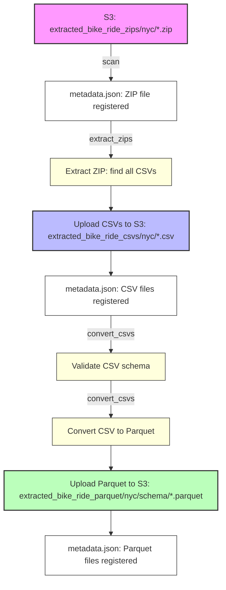

# Extracted File Manager: S3 ZIP/CSV/Parquet Pipeline

## Pipeline Flow Diagram



## Key Features

- **Separation of Concerns:**
  - `extract_zips`: Only extracts ZIPs to CSVs (no validation or Parquet conversion).
  - `convert_csvs`: Only validates and converts CSVs to Parquet (no ZIP extraction).
- **Automatic Metadata Recovery:**
  - If `metadata.json` is missing, the manager will automatically scan S3 and rebuild it.
- **Convenience Pipeline:**
  - The `pipeline` command simply runs `extract_zips` and then `convert_csvs` in order.
- **Mac OS Hidden File Filtering:**
  - Automatically filters out Mac OS hidden files (starting with `._`) during ZIP extraction.
  - Prevents system files from causing validation errors and cluttering the pipeline.

## Usage

### Typical Workflow

```bash
# 1. Scan for new files (auto-run if metadata is missing)
python -m extracted_file_manager.cli scan

# 2. Extract all unprocessed ZIPs to CSVs
python -m extracted_file_manager.cli extract_zips

# 3. Validate and convert all unprocessed CSVs to Parquet
python -m extracted_file_manager.cli convert_csvs

# (Optional) Run both steps in sequence
python -m extracted_file_manager.cli pipeline

# List files by status
python -m extracted_file_manager.cli list --status validated

# Show summary
python -m extracted_file_manager.cli summary

# Reset failed files (just reset flags, don't reprocess)
python -m extracted_file_manager.cli reset-failed --location nyc

# Reset and reprocess failed files
python -m extracted_file_manager.cli reprocess-failed --location nyc --confirm
```

### CLI Commands

- `scan`: Scan S3 for new files and update metadata
- `extract_zips`: Extract all unprocessed ZIPs to CSVs
- `convert_csvs`: Validate and convert all unprocessed CSVs to Parquet
- `pipeline`: (Convenience) Runs `extract_zips` then `convert_csvs`
- `validate`: Validate files (without conversion)
- `list`: List files by status/type
- `summary`: Show a summary of all files
- `reprocess`: Reset a file's status for reprocessing
- `reset-failed`: Reset failed files to 'extracted' status (does not reprocess)
- `reprocess-failed`: Reset failed files to 'extracted' status and reprocess them

### Failed File Management

Two commands are available for handling failed files:

- **`reset-failed`**: Only resets the metadata flags of failed files to 'extracted' status. This is useful when you want to manually inspect or fix files before reprocessing.

- **`reprocess-failed`**: Resets failed files to 'extracted' status AND immediately reprocesses them through the pipeline. This is useful when you've fixed the underlying issue and want to retry processing.

Both commands support filtering by `--location` (nyc/london) and `--file-type` (zip/csv/parquet).

### Wipe Operations (Destructive)
⚠️ **WARNING**: These commands permanently delete files from S3 and require `--confirm` flag.

- `wipe-file --file <filename> --confirm` - Wipe a specific file
- `wipe-type --type <type> [--location <location>] [--schema <schema>] --confirm` - Wipe files by type
- `wipe-all --confirm` - Wipe all files

#### Wipe Examples:
```bash
# Wipe a specific file
python -m extracted_file_manager.cli wipe-file --file "2023-01-nyc-data.zip" --confirm

# Wipe all NYC ZIP files
python -m extracted_file_manager.cli wipe-type --type nyc_zip --confirm

# Wipe all NYC CSV files
python -m extracted_file_manager.cli wipe-type --type nyc_csv --location nyc --confirm

# Wipe all London Parquet files with specific schema
python -m extracted_file_manager.cli wipe-type --type london_parquet --location london --schema modern --confirm

# Wipe all files (nuclear option)
python -m extracted_file_manager.cli wipe-all --confirm
```

#### File Types for Wipe Operations:
- `nyc_zip` - NYC ZIP files
- `nyc_csv` - NYC CSV files  
- `london_csv` - London CSV files
- `nyc_parquet` - NYC Parquet files
- `london_parquet` - London Parquet files

#### Location Filters:
- `nyc` - New York City files
- `london` - London files

#### Schema Filters (for Parquet files):
- `legacy` - Legacy data schema
- `modern` - Modern data schema

## Metadata Auto-Scan

- If `metadata.json` is missing from S3, the manager will automatically run a scan to rebuild it before any other operation.
- You do not need to manually run `scan` after deleting metadata; it will be handled for you.

## Pipeline Overview

The system implements a complete data pipeline:

```
extracted_bike_ride_zips/{city}/     # Raw ZIP files from extraction
    ↓ (ZIP → CSV extraction)
extracted_bike_ride_csvs/{city}/     # Extracted CSV files
    ↓ (Schema validation & Parquet conversion)
extracted_bike_ride_parquet/{city}/{schema}/  # Parquet files organized by schema
```

## Data Model Integration

The system automatically determines the correct schema using your existing data models:

- `NYCLegacyBikeShareRecord` for legacy NYC format
- `NYCModernBikeShareRecord` for modern NYC format  
- `LondonBikeShareRecord` for London format

## Metadata Tracking

All file operations are tracked in S3 at `extracted_file_manager/metadata.json` including:

- File locations and sizes
- Processing timestamps
- Validation results
- Error messages
- Pipeline relationships

## Error Handling

- Failed operations are marked with `FAILED` status
- Error messages are stored in metadata
- Files can be reprocessed using `reprocess_file()`
- Pipeline continues processing other files even if some fail

## Memory Management

The system includes advanced memory management to prevent Out-of-Memory (OOM) issues when processing large files:

### Key Features
- **Memory Monitoring**: Logs memory usage at key points for debugging
- **Explicit Cleanup**: DataFrames and buffers are explicitly deleted after use
- **Streaming Processing**: Uses pyarrow streaming with 5MB chunks for large files
- **Sample Validation**: Downloads only 5MB samples for schema validation
- **Batch Processing**: Forces garbage collection between files
- **Resource Tracking**: All temporary files and writers are properly cleaned up

### Implementation Details

#### Memory Monitoring
```python
# Memory usage is logged before and after major operations
Memory usage before validation: 103.4 MB
Memory usage after cleanup: 102.1 MB
Memory usage before conversion: 105.7 MB
Memory usage after conversion: 104.2 MB
```

#### Streaming Processing
- **CSV to Parquet**: Uses pyarrow streaming with 5MB blocks (reduced from 10MB)
- **Chunk Processing**: Each chunk is processed and immediately cleaned up
- **Periodic Cleanup**: Memory cleanup every 10 batches
- **Sample Validation**: Only downloads 5MB sample for schema validation

#### Batch Processing
- **Memory cleanup after each file**: Forces garbage collection between files
- **Progress tracking**: Shows progress (X/Y files) for better monitoring
- **Delays**: 1-second delays between files to allow memory cleanup

### Best Practices
1. **Always Clean Up Resources**: Use `del` to explicitly delete large objects
2. **Process in Chunks**: Use streaming readers for large files
3. **Monitor Memory Usage**: Log memory usage at key points
4. **Use Temporary Files**: Download large files to temp files instead of memory

### Performance Impact
- **Benefits**: Prevents OOM errors, stable processing, better monitoring
- **Overhead**: Minimal overhead from memory logging, acceptable 1-second delays
- **Result**: Eliminates crashes and data loss from memory issues

---

For more details, see the code and docstrings in `manager.py` and `cli.py`. 