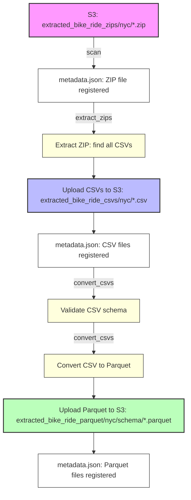

# Extracted File Manager: S3 ZIP/CSV/Parquet Pipeline

A robust file management system for processing bike share data from ZIP archives through CSV extraction to optimized Parquet storage, with comprehensive metadata tracking and memory management.

## Pipeline Flow Diagram



## Key Features

- **🔄 Pipeline Separation**: Independent `extract_zips` and `convert_csvs` commands for granular control
- **🧠 Smart Schema Detection**: Automatic data model matching using your existing bike share models
- **💾 Memory Management**: Advanced memory monitoring and cleanup to prevent OOM errors
- **📊 Comprehensive Metadata**: Full tracking of file status, processing history, and relationships
- **🛡️ Error Recovery**: Failed files can be reset and reprocessed without data loss
- **🗑️ Safe Cleanup**: Destructive operations require confirmation and provide detailed feedback
- **🔍 Debug Support**: Detailed logging for troubleshooting validation and conversion issues

## Quick Start

### Basic Workflow

```bash
# 1. Scan for new files (auto-run if metadata is missing)
python -m extracted_file_manager.cli scan

# 2. Extract all unprocessed ZIPs to CSVs
python -m extracted_file_manager.cli extract_zips

# 3. Validate and convert all unprocessed CSVs to Parquet
python -m extracted_file_manager.cli convert_csvs

# 4. Check results
python -m extracted_file_manager.cli summary
```

### Location-Specific Processing

```bash
# Process only NYC files
python -m extracted_file_manager.cli extract_zips --location nyc
python -m extracted_file_manager.cli convert_csvs --location nyc

# Process only London files
python -m extracted_file_manager.cli extract_zips --location london
python -m extracted_file_manager.cli convert_csvs --location london
```

### Single File Processing

```bash
# Process a specific ZIP file
python -m extracted_file_manager.cli extract_zips --file "2023-01-nyc-data.zip"

# Process a specific CSV file
python -m extracted_file_manager.cli convert_csvs --file "2023-01-nyc-data.csv"
```

## CLI Commands Reference

### Core Pipeline Commands

| Command | Description | Options |
|---------|-------------|---------|
| `scan` | Scan S3 for new files and update metadata | None |
| `extract_zips` | Extract ZIPs to CSVs | `--location`, `--file` |
| `convert_csvs` | Validate and convert CSVs to Parquet | `--location`, `--file` |
| `validate` | Validate file schemas (without conversion) | `--file`, `--file-type`, `--debug` |

### File Management Commands

| Command | Description | Options |
|---------|-------------|---------|
| `list` | List files with filters | `--status`, `--file-type`, `--location` |
| `summary` | Show comprehensive file statistics | None |
| `reprocess` | Reset a single file for reprocessing | `--file` |

### Failed File Recovery

| Command | Description | Options |
|---------|-------------|---------|
| `reset-failed` | Reset failed files to 'extracted' status | `--location`, `--file-type`, `--confirm`, `--reprocess` |

### Destructive Operations ⚠️

| Command | Description | Options |
|---------|-------------|---------|
| `wipe-file` | Delete a specific file | `--file`, `--confirm` |
| `wipe-type` | Delete files by type/location | `--file-type`, `--location`, `--schema`, `--confirm` |
| `wipe-all` | Delete ALL files (nuclear option) | `--confirm` |

### Utility Commands

| Command | Description | Options |
|---------|-------------|---------|
| `set-schema` | Set or clear manual schema override | `--file`, `--schema`, `--clear` |

## Detailed Usage Examples

### File Status Monitoring

```bash
# List all files
python -m extracted_file_manager.cli list

# List only validated files
python -m extracted_file_manager.cli list --status validated

# List only CSV files
python -m extracted_file_manager.cli list --file-type csv

# List only NYC files
python -m extracted_file_manager.cli list --location nyc

# List only NYC CSV files
python -m extracted_file_manager.cli list --file-type csv --location nyc

# List failed files
python -m extracted_file_manager.cli list --status failed
```

### Failed File Recovery

```bash
# Reset all failed files (doesn't reprocess)
python -m extracted_file_manager.cli reset-failed

# Reset only NYC failed files
python -m extracted_file_manager.cli reset-failed --location nyc

# Reset only CSV failed files
python -m extracted_file_manager.cli reset-failed --file-type csv

# Reset and reprocess all failed files
python -m extracted_file_manager.cli reset-failed --reprocess --confirm

# Reset and reprocess only London CSV files
python -m extracted_file_manager.cli reset-failed --location london --file-type csv --reprocess --confirm
```

### Debug and Troubleshooting

```bash
# Enable debug logging for validation
python -m extracted_file_manager.cli validate --file problematic-file.csv --debug

# Validate all files with debug output
python -m extracted_file_manager.cli validate --debug
```

### Wipe Operations (Destructive)

```bash
# Wipe a specific file
python -m extracted_file_manager.cli wipe-file --file "2023-01-nyc-data.zip" --confirm

# Wipe all ZIP files
python -m extracted_file_manager.cli wipe-type --file-type zip --confirm

# Wipe all NYC CSV files
python -m extracted_file_manager.cli wipe-type --file-type csv --location nyc --confirm

# Wipe all London Parquet files
python -m extracted_file_manager.cli wipe-type --file-type parquet --location london --confirm

# Wipe all Parquet files (resets CSV status)
python -m extracted_file_manager.cli wipe-type --file-type parquet --confirm

# Nuclear option - wipe everything
python -m extracted_file_manager.cli wipe-all --confirm
```

### Schema Management

```bash
# Set manual schema override for a problematic file
python -m extracted_file_manager.cli set-schema --file "legacy-format.csv" --schema "NYCLegacyBikeShareRecord"

# Clear schema override
python -m extracted_file_manager.cli set-schema --file "legacy-format.csv" --clear
```

## File Type and Location Options

### File Types (--file-type)
- `zip` - ZIP files
- `csv` - CSV files  
- `parquet` - Parquet files

### Locations (--location)
- `nyc` - New York City files
- `london` - London files

### Status Values (--status)
- `extracted` - File has been downloaded to S3
- `csv_converted` - ZIP has been converted to CSV
- `validated` - File has been schema validated
- `parquet_converted` - CSV has been converted to Parquet
- `processed` - File has been loaded into database
- `failed` - File processing failed
- `deleted` - File has been deleted

## Memory Management

The system includes advanced memory management to prevent Out-of-Memory (OOM) issues:

### Key Features
- **Memory Monitoring**: Logs memory usage at key points
- **Streaming Processing**: Uses pyarrow streaming with 5MB chunks
- **Sample Validation**: Downloads only 5MB samples for schema validation
- **Explicit Cleanup**: DataFrames and buffers are explicitly deleted
- **Batch Processing**: Forces garbage collection between files

### Memory Usage Example
```
Memory usage before validation: 103.4 MB
Memory usage after cleanup: 102.1 MB
Memory usage before conversion: 105.7 MB
Memory usage after conversion: 104.2 MB
```

## Debug Output

When validation fails, debug output shows:
```
DEBUG: Found 2 models to test for FileType.LONDON_CSV
DEBUG: Available columns in file: ['Rental Id', 'Duration', 'Bike Id', 'End Date', 'EndStation Name', 'Start Date', 'StartStation Id', 'StartStation Name']
DEBUG: Testing model: LondonLegacyBikeShareRecord
DEBUG: ✗ Model LondonLegacyBikeShareRecord failed - missing columns: ['EndStation Id']
DEBUG: Testing model: LondonModernBikeShareRecord
DEBUG: ✗ Model LondonModernBikeShareRecord failed - missing columns: ['Number', 'Bike model', 'Start date', 'End date', 'Start station number', 'Start station', 'End station number', 'End station', 'Total duration']
DEBUG: ✗ No matching data model found for FileType.LONDON_CSV
```

## Pipeline Architecture

### S3 Structure
```
extracted_bike_ride_zips/{city}/     # Raw ZIP files from extraction
    ↓ (ZIP → CSV extraction)
extracted_bike_ride_csvs/{city}/     # Extracted CSV files
    ↓ (Schema validation & Parquet conversion)
extracted_bike_ride_parquet/{city}/{schema}/  # Parquet files organized by schema
```

### Data Model Integration
The system automatically determines the correct schema using your existing data models:
- `NYCLegacyBikeShareRecord` for legacy NYC format
- `NYCModernBikeShareRecord` for modern NYC format  
- `LondonLegacyBikeShareRecord` for legacy London format
- `LondonModernBikeShareRecord` for modern London format

### Metadata Tracking
All operations are tracked in S3 at `extracted_file_manager/metadata.json`:
- File locations and sizes
- Processing timestamps
- Validation results and errors
- Pipeline relationships
- Schema overrides

## Error Handling

- Failed operations are marked with `FAILED` status
- Error messages are stored in metadata for debugging
- Files can be reprocessed using `reset-failed` or `reprocess-failed`
- Pipeline continues processing other files even if some fail
- Memory cleanup ensures system stability

## Best Practices

1. **Start with Scan**: Always run `scan` first to ensure metadata is current
2. **Process in Batches**: Use location filters to process manageable batches
3. **Monitor Memory**: Watch memory usage logs for large file processing
4. **Use Debug Mode**: Enable `--debug` when troubleshooting validation issues
5. **Backup Before Wipe**: Always verify before running destructive operations
6. **Check Status**: Use `list` and `summary` to monitor pipeline progress

## Troubleshooting

### Common Issues

**Validation Failures**: Use `--debug` flag to see detailed validation information
```bash
python -m extracted_file_manager.cli validate --file problematic.csv --debug
```

**Memory Issues**: Check memory usage logs and consider processing smaller batches
```bash
python -m extracted_file_manager.cli convert_csvs --location nyc  # Process one city at a time
```

**Failed Files**: Reset and reprocess failed files
```bash
python -m extracted_file_manager.cli reprocess-failed --confirm
```

**Schema Mismatches**: Set manual schema override for problematic files
```bash
python -m extracted_file_manager.cli set-schema --file "legacy.csv" --schema "NYCLegacyBikeShareRecord"
```

---

For more details, see the code and docstrings in `manager.py` and `cli.py`. 