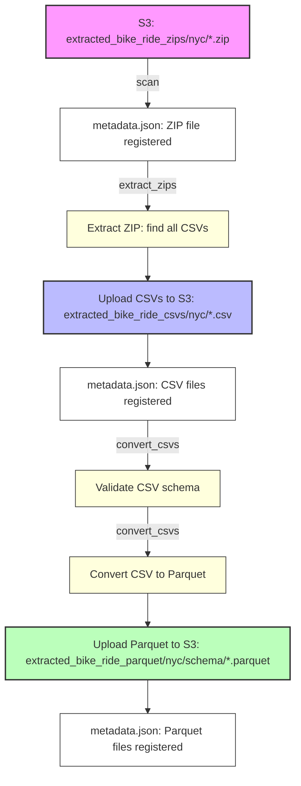

# Extracted File Manager: S3 ZIP/CSV/Parquet Pipeline

## Pipeline Flow Diagram



## Key Features

- **Separation of Concerns:**
  - `extract_zips`: Only extracts ZIPs to CSVs (no validation or Parquet conversion).
  - `convert_csvs`: Only validates and converts CSVs to Parquet (no ZIP extraction).
- **Automatic Metadata Recovery:**
  - If `metadata.json` is missing, the manager will automatically scan S3 and rebuild it.
- **Convenience Pipeline:**
  - The `pipeline` command simply runs `extract_zips` and then `convert_csvs` in order.

## Usage

### Typical Workflow

```bash
# 1. Scan for new files (auto-run if metadata is missing)
python -m extracted_file_manager.cli scan

# 2. Extract all unprocessed ZIPs to CSVs
python -m extracted_file_manager.cli extract_zips

# 3. Validate and convert all unprocessed CSVs to Parquet
python -m extracted_file_manager.cli convert_csvs

# (Optional) Run both steps in sequence
python -m extracted_file_manager.cli pipeline

# List files by status
python -m extracted_file_manager.cli list --status validated

# Show summary
python -m extracted_file_manager.cli summary
```

### CLI Commands

- `scan`: Scan S3 for new files and update metadata
- `extract_zips`: Extract all unprocessed ZIPs to CSVs
- `convert_csvs`: Validate and convert all unprocessed CSVs to Parquet
- `pipeline`: (Convenience) Runs `extract_zips` then `convert_csvs`
- `validate`: Validate files (without conversion)
- `list`: List files by status/type
- `summary`: Show a summary of all files
- `reprocess`: Reset a file's status for reprocessing

> **Note:** The old `convert-zip` and `convert-csv` commands for single-file processing have been removed for simplicity. Use the batch commands above for all processing.

## Metadata Auto-Scan

- If `metadata.json` is missing from S3, the manager will automatically run a scan to rebuild it before any other operation.
- You do not need to manually run `scan` after deleting metadata; it will be handled for you.

## Pipeline Overview

The system implements a complete data pipeline:

```
extracted_bike_ride_zips/{city}/     # Raw ZIP files from extraction
    ↓ (ZIP → CSV extraction)
extracted_bike_ride_csvs/{city}/     # Extracted CSV files
    ↓ (Schema validation & Parquet conversion)
extracted_bike_ride_parquet/{city}/{schema}/  # Parquet files organized by schema
```

## Data Model Integration

The system automatically determines the correct schema using your existing data models:

- `NYCLegacyBikeShareRecord` for legacy NYC format
- `NYCModernBikeShareRecord` for modern NYC format  
- `LondonBikeShareRecord` for London format

## Metadata Tracking

All file operations are tracked in S3 at `extracted_file_manager/metadata.json` including:

- File locations and sizes
- Processing timestamps
- Validation results
- Error messages
- Pipeline relationships

## Error Handling

- Failed operations are marked with `FAILED` status
- Error messages are stored in metadata
- Files can be reprocessed using `reprocess_file()`
- Pipeline continues processing other files even if some fail

---

For more details, see the code and docstrings in `manager.py` and `cli.py`. 