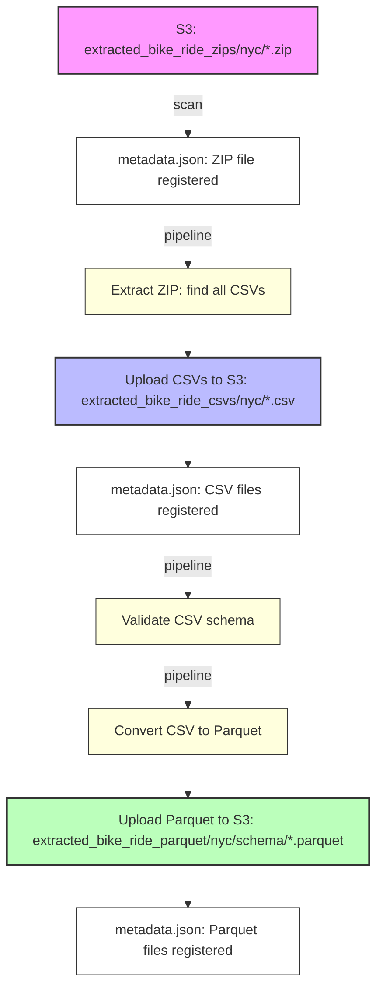

# Extracted File Manager: S3 ZIP/CSV/Parquet Pipeline

## Pipeline Flow Diagram



## Explanation

1. **ZIPs in S3**: Place raw ZIP files in `extracted_bike_ride_zips/nyc/` (or `london/`).
2. **Scan**: Run `python -m extracted_file_manager.cli scan` to populate `metadata.json` with all found files (ZIPs, CSVs, Parquet, etc.).
3. **Pipeline Step 1**: The pipeline finds ZIPs needing processing, extracts all CSVs from each ZIP, and uploads them to `extracted_bike_ride_csvs/{city}/`.
4. **Metadata Update**: Each new CSV is registered in `metadata.json` for further processing.
5. **Pipeline Step 2**: Each CSV is validated against the schema using the data models.
6. **Pipeline Step 3**: Validated CSVs are converted to Parquet, uploaded to `extracted_bike_ride_parquet/{city}/{schema}/`, and registered in metadata.

- If you delete `metadata.json`, you must re-run `scan` to repopulate the file list from S3.
- The pipeline will always extract and register new CSVs from ZIPs, so you do not need to manually track ZIP contents.

# Extracted File Manager

Manages extracted ZIP and CSV files on S3 with a complete pipeline for data processing.

## Pipeline Overview

The system implements a complete data pipeline:

```
extracted_bike_ride_zips/{city}/     # Raw ZIP files from extraction
    ↓ (ZIP → CSV conversion)
extracted_bike_ride_csvs/{city}/     # Extracted CSV files
    ↓ (Schema validation)
extracted_bike_ride_parquet/{city}/{schema}/  # Parquet files organized by schema
```

### Pipeline Steps

1. **ZIP Extraction**: NYC ZIP files are extracted to CSV format
2. **Schema Validation**: CSV files are validated against data models
3. **Parquet Conversion**: Validated CSV files are converted to Parquet with schema-based organization

## File Types

- `NYC_ZIP`: Raw ZIP files from NYC CitiBike
- `NYC_CSV`: Extracted CSV files from NYC
- `LONDON_CSV`: CSV files from London TfL
- `NYC_PARQUET`: Parquet files from NYC data
- `LONDON_PARQUET`: Parquet files from London data

## File Statuses

- `EXTRACTED`: File has been downloaded to S3
- `CSV_CONVERTED`: ZIP has been converted to CSV
- `VALIDATED`: File has been schema validated
- `PARQUET_CONVERTED`: CSV has been converted to Parquet
- `PROCESSED`: File has been loaded into database
- `FAILED`: File processing failed
- `DELETED`: File has been deleted

## Usage

### Basic Usage

```python
from extracted_file_manager import ExtractedFileManager

# Initialize manager
manager = ExtractedFileManager()

# Scan for new files
new_files = manager.scan_s3_files()

# Process entire pipeline
results = manager.process_all_pipelines()

# Get summary
manager.print_summary()
```

### CLI Usage

```bash
# Scan for new files
python -m extracted_file_manager.cli scan

# Validate all files
python -m extracted_file_manager.cli validate

# Convert specific ZIP to CSV
python -m extracted_file_manager.cli convert-zip --file 201906-citibike-tripdata.zip

# Convert specific CSV to Parquet
python -m extracted_file_manager.cli convert-csv --file 201906-citibike-tripdata.csv

# Process entire pipeline for all files
python -m extracted_file_manager.cli pipeline

# List files by status
python -m extracted_file_manager.cli list --status validated

# Show summary
python -m extracted_file_manager.cli summary
```

## Schema Organization

Parquet files are organized by schema determined by data model validation:

```
extracted_bike_ride_parquet/
├── nyc/
│   ├── nyclegacybikesharerecord/
│   │   └── 201906-citibike-tripdata.parquet
│   └── nycmodernbikesharerecord/
│       └── 202312-citibike-tripdata.parquet
└── london/
    └── londonbikesharerecord/
        └── JourneyDataExtract_201912.csv.parquet
```

## Data Model Integration

The system automatically determines the correct schema using your existing data models:

- `NYCLegacyBikeShareRecord` for legacy NYC format
- `NYCModernBikeShareRecord` for modern NYC format  
- `LondonBikeShareRecord` for London format

## Metadata Tracking

All file operations are tracked in S3 at `extracted_file_manager/metadata.json` including:

- File locations and sizes
- Processing timestamps
- Validation results
- Error messages
- Pipeline relationships

## Error Handling

- Failed operations are marked with `FAILED` status
- Error messages are stored in metadata
- Files can be reprocessed using `reprocess_file()`
- Pipeline continues processing other files even if some fail 